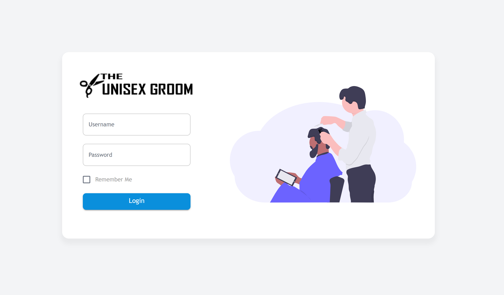
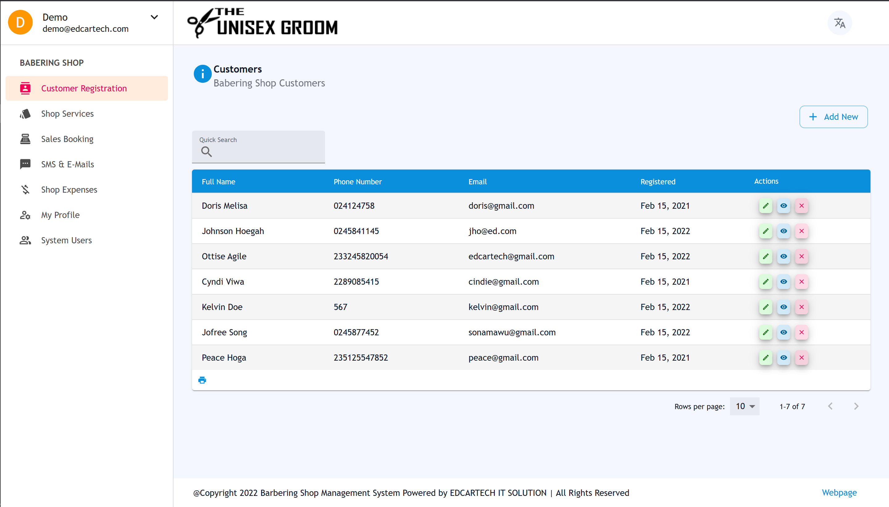
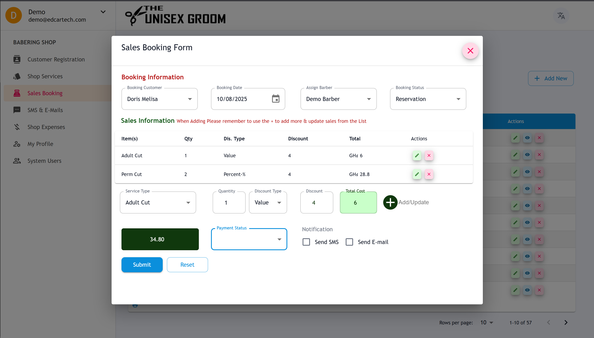

# Barber Shop Management System

A comprehensive web application built with Next.js and React for managing barber shop operations.

## Features

- **Customer Management**: Register and manage customer information
- **Service Management**: Add, edit, and manage barber services
- **Sales Booking**: Handle service bookings and sales transactions
- **Expense Tracking**: Manage shop expenses and financial records
- **User Management**: System user administration and authentication
- **Dashboard**: Overview of business operations and metrics

## Screenshots

### Login Page

*Secure authentication with modern UI design*

### Customer Management

*Comprehensive customer registration and management system*

### Sales Booking

*Easy-to-use sales booking and transaction management*

## Technology Stack

- **Frontend**: Next.js, React, TypeScript
- **UI Framework**: Material-UI (MUI)
- **State Management**: Redux
- **Authentication**: JWT-based authentication
- **Styling**: Tailwind CSS
- **Icons**: React Icons

## Project Structure

```
src/
├── modules/
│   ├── Barber/           # Core barber shop functionality
│   ├── auth/            # Authentication modules
│   └── userAccount/     # User account management
├── pages/
│   ├── barber/          # Barber shop pages
│   ├── api/barber/      # Barber shop API endpoints
│   └── auth/            # Authentication pages
├── redux/               # State management
├── types/               # TypeScript type definitions
└── shared/              # Shared utilities and constants
```

## Getting Started

### Prerequisites
- Node.js (v14 or higher)
- Yarn package manager
- MongoDB or MySQL database

### Installation

1. Clone the repository:
   ```bash
   git clone <repository-url>
   cd barber-shop
   ```

2. Install dependencies:
   ```bash
   yarn install
   ```

3. Set up environment variables:
   ```bash
   cp example.env .env.local
   ```
   
   Edit `.env.local` and configure:
   - Database connection (MongoDB or MySQL)
   - JWT secret for authentication
   - Cloudinary credentials for file uploads
   - Other optional services as needed

4. Set up your database:
   - **MongoDB**: Create a database named `barber_shop`
   - **MySQL**: Create databases `barber_shop` and `barber_shop_auth`

5. Run the development server:
   ```bash
   yarn dev
   ```

6. Open [http://localhost:3000](http://localhost:3000) in your browser.

### Environment Variables

The application requires several environment variables to function properly. Copy `example.env` to `.env.local` and update the values:

**Required:**
- `JWT_SECRET` - Secret key for JWT authentication
- Database configuration (choose MongoDB or MySQL)
- `CLOUDINARY_*` - For file upload functionality

**Optional:**
- Email/SMS configuration for notifications
- Payment gateway keys
- Google API keys

See `example.env` for a complete list of available variables.

## Demo

You can try the application online at: [https://barber-shop-mu.vercel.app/](https://barber-shop-mu.vercel.app/)

**Demo Credentials:**
- Username: `demo`
- Password: `password`

## Available Scripts

- `yarn dev` - Start development server
- `yarn build` - Build for production
- `yarn start` - Start production server
- `yarn lint` - Run ESLint

## Main Modules

### Barber Shop Module
- Customer registration and management
- Service catalog management
- Sales booking system
- Expense tracking and reporting

### Authentication
- User login and registration
- Password management
- Session handling

### User Management
- System user administration
- Role-based access control
- User profile management

## API Endpoints

The application provides RESTful API endpoints for:
- Customer CRUD operations
- Service management
- Sales booking
- Expense tracking
- User authentication and management

## License

This project is licensed under the MIT License - see the [LICENSE](LICENSE) file for details.

## Usage

Feel free to use this code for learning, personal projects, or commercial use.
Attribution is appreciated but not required.
